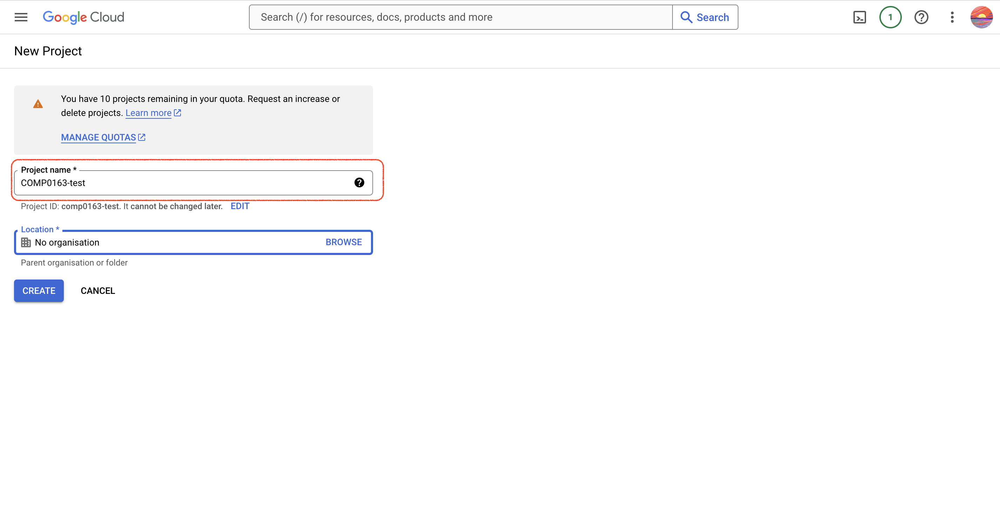
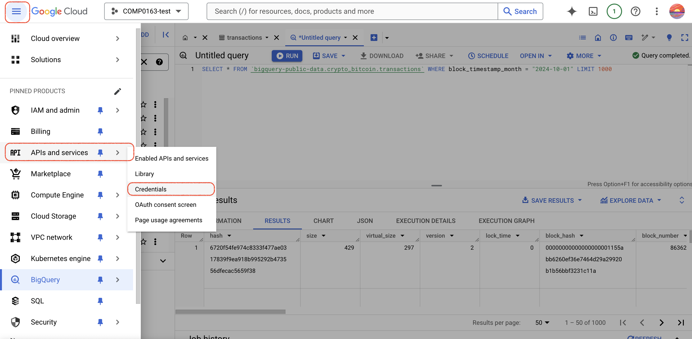

# Fetch on-chain data from BigQuery

- Author: Yichen Luo
- Date: 2024-10-01

## Dependencies

run following commands in the terminal first

```bash
pip install --upgrade google-cloud-bigquery
```

```Python
import os

from google.cloud import bigquery
from pandas import json_normalize
```

## Google BigQuery

Google BigQuery is a serverless, highly scalable, and cost-effective multi-cloud data warehouse designed for business agility. It enables super-fast SQL queries using the processing power of Google's infrastructure. BigQuery is a powerful tool for data analysis and visualization.

### Blockchain Data on BigQuery

Google BigQuery provides a dataset of blockchain data from various blockchains, including Bitcoin, Ethereum, and Litecoin. The dataset is updated regularly and contains a wealth of information about the blockchain, such as transactions, blocks, addresses, and more.

### Accessing Blockchain Data on BigQuery Playground

- Step 1: Go to the [Google Cloud Console](https://console.cloud.google.com/).
  


- Step 2: Create a new project or select an existing project.





- Step 3: Enter the BigQuery console.


- Step 4: Select the dataset you want to query.


- Step 5: Open the playground to run SQL queries.


- Step 6: Write and run your SQL query to fetch blockchain data.


### Accessing Blockchain Data using API

- Step 1: Enter the credentials page.




- Step 2: Create a service account.


- Step 3: Download the JSON key file.


- Step 4: Put the JSON key file in your project directory.

### Fetching Blockchain Data using Python

```Python
os.environ["GOOGLE_APPLICATION_CREDENTIALS"] = "YOUR_JSON_KEY_FILE.json"
client = bigquery.Client()

# Perform a query.
query_btc = ("""
select *,
from bigquery-public-data.crypto_bitcoin.transactions
WHERE block_timestamp_month = "2024-10-01"
LIMIT 1000
""")

query_job = client.query(query_btc)  # API request
rows = query_job.result()  # Waits for query to finish


field_names = [f.name for f in rows.schema]
# needs to be done in once, otherwise 'Iterator has already started' error
btc_tx_value = [{
    field: row[field] for field in field_names
} for row in rows]

json_normalize(btc_tx_value)
```
